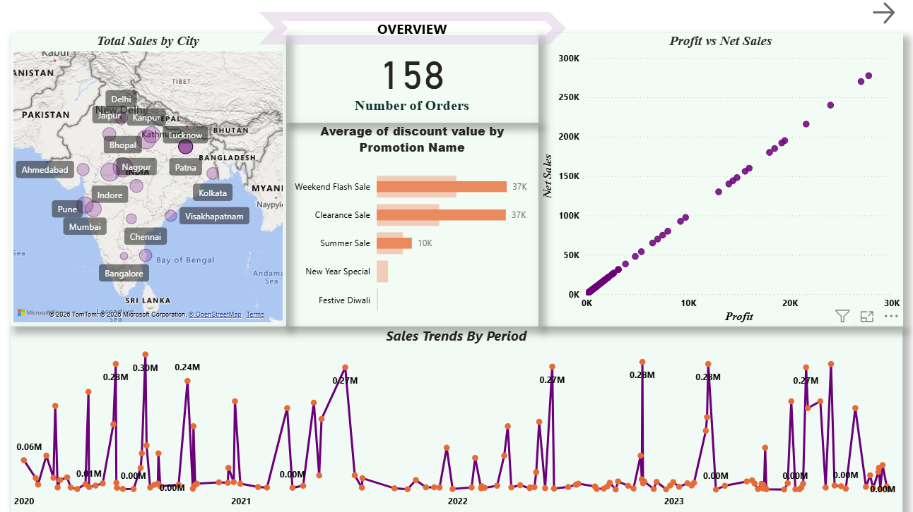
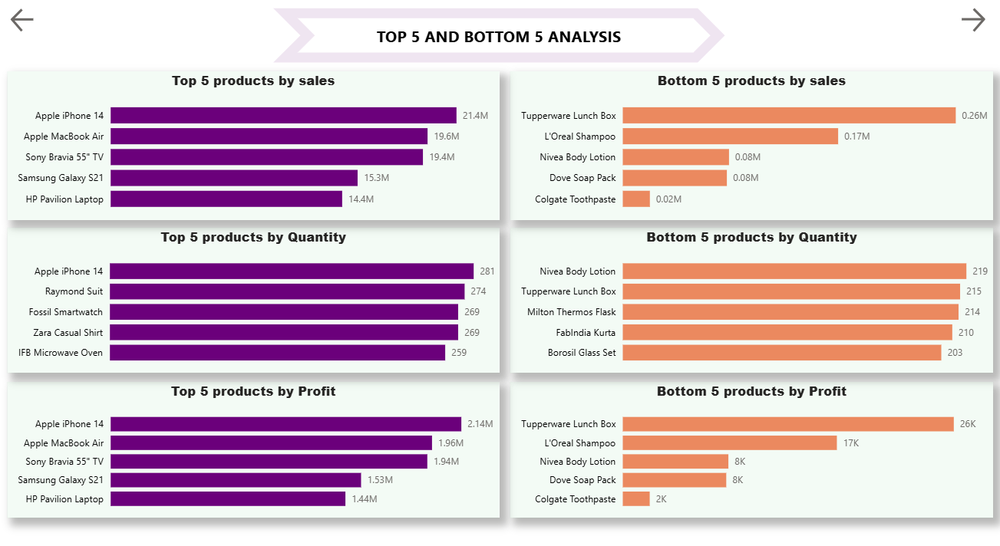
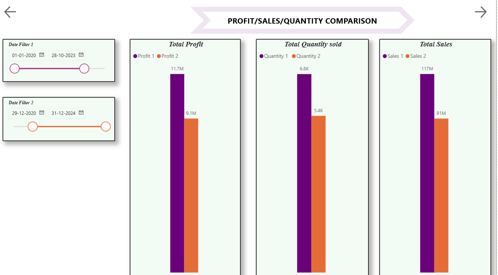
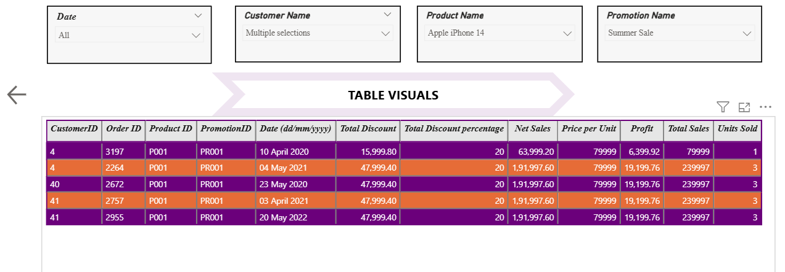

# 📊 Retail Sales Performance Dashboard (Power BI)

## 📌 Project Overview
This project presents an interactive Power BI dashboard built to analyze retail sales data and generate actionable business insights.  

The dashboard focuses on evaluating sales performance, profitability trends, product contribution, promotional impact, and regional distribution.

---

## 📁 Repository Structure

- `sales-data-analysis.pbix` – Power BI dashboard file  
- `store_data.xlsx` – Dataset used for analysis  
- `screenshots/` – Dashboard preview images  

---

## 📈 Business Questions Answered

- Which products generate the highest and lowest sales, profit, and quantity?
- How do sales trends vary across daily, monthly, and yearly periods?
- What is the relationship between sales and profit?
- How do discounts and promotions impact revenue?
- Which cities contribute most to overall sales?
- How does performance compare between two selected time periods?
- What insights can be derived from order-level data using dynamic filters?

---

## 🔍 Key Features

- KPI Cards (Total Orders, Sales, Profit, Quantity Sold)
- Top 5 & Bottom 5 Product Analysis
- Sales vs Profit Scatter Plot
- Time-Series Sales Trend Visualization
- Dual Date Period Comparison
- Promotion-wise Discount Analysis
- City-wise Sales Map
- Detailed Order-Level Table with Filters

---

## 🛠 Tools & Techniques Used

- Power BI
- Data Modeling
- DAX Calculations
- Time Intelligence Functions
- Interactive Slicers & Filters
- Business-Focused Data Visualization

---

## 📊 Dashboard Preview

### Overview


### Top & Bottom Product Analysis


### Period Comparison


### Table Visuals


---

## 📐 Sample DAX Measures

```DAX
Total Sales = SUM(Sales[Total_Sales])
Total Profit = SUM(Sales[Profit])
Total Orders = DISTINCTCOUNT(Sales[OrderID])
Average Discount = AVERAGE(Sales[Discount])
Net Sales = [Total Sales] - [Total Discount]
